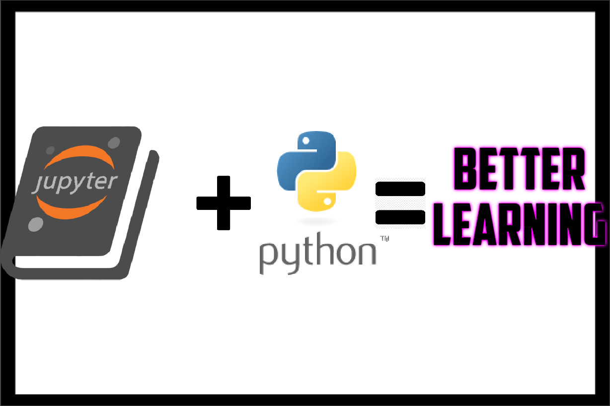

  

# Learn Python 3

## Introduction

This repository contains a collection of materials for teaching/learning Python 3 (3.10+).

#### Requirements
* Have Python 3.10 or newer installed. You can check the version by typing `python3 --version` in your command line. You can download the latest Python version from [here](https://www.python.org/downloads/).
* Have [Jupyter Notebook installed](http://jupyter.readthedocs.io/en/latest/install.html). `pip install jupyter` is sufficient in most cases.

If you can not access Python and/or Jupyter Notebook on your machine, you can still follow the web based materials. However, you should be able to use Jupyter Notebook in order to complete the exercises.

#### Usage (locally)

1. Clone or download this repository.
2. Run `jupyter notebook` command in your command line in the repository directory.
3. Jupyter Notebook session will open in the browser and you can start navigating through the materials.

#### Usage (Binder in the cloud)

You can also just use [Binder:](https://mybinder.org/) By clicking of this  badge, the project is opened in a Jupyter instance in the cloud and you can then navigate to the folders containing the notebooks and start them each and interactively explore them! 

#### Contributing
See [contributing](https://github.com/jerry-git/learn-python3/blob/master/CONTRIBUTING.md) guide.

## Beginner
1. [Strings](https://jerry-git.github.io/learn-python3/notebooks/beginner/html/01_strings.html) [[notebook]](http://nbviewer.jupyter.org/github/jerry-git/learn-python3/blob/master/notebooks/beginner/notebooks/01_strings.ipynb) [[exercise]](http://nbviewer.jupyter.org/github/jerry-git/learn-python3/blob/master/notebooks/beginner/exercises/01_strings_exercise.ipynb)
2. [Numbers](https://jerry-git.github.io/learn-python3/notebooks/beginner/html/02_numbers.html) [[notebook]](http://nbviewer.jupyter.org/github/jerry-git/learn-python3/blob/master/notebooks/beginner/notebooks/02_numbers.ipynb) [[exercise]](http://nbviewer.jupyter.org/github/jerry-git/learn-python3/blob/master/notebooks/beginner/exercises/02_numbers_exercise.ipynb)
3. [Conditionals](https://jerry-git.github.io/learn-python3/notebooks/beginner/html/03_conditionals.html) [[notebook]](http://nbviewer.jupyter.org/github/jerry-git/learn-python3/blob/master/notebooks/beginner/notebooks/03_conditionals.ipynb) [[exercise]](http://nbviewer.jupyter.org/github/jerry-git/learn-python3/blob/master/notebooks/beginner/exercises/03_conditionals_exercise.ipynb)
4. [Lists](https://jerry-git.github.io/learn-python3/notebooks/beginner/html/04_lists.html) [[notebook]](http://nbviewer.jupyter.org/github/jerry-git/learn-python3/blob/master/notebooks/beginner/notebooks/04_lists.ipynb) [[exercise]](http://nbviewer.jupyter.org/github/jerry-git/learn-python3/blob/master/notebooks/beginner/exercises/04_lists_exercise.ipynb)
5. [Dictionaries](https://jerry-git.github.io/learn-python3/notebooks/beginner/html/05_dictionaries.html) [[notebook]](http://nbviewer.jupyter.org/github/jerry-git/learn-python3/blob/master/notebooks/beginner/notebooks/05_dictionaries.ipynb) [[exercise]](http://nbviewer.jupyter.org/github/jerry-git/learn-python3/blob/master/notebooks/beginner/exercises/05_dictionaries_exercise.ipynb)
6. [For loops](https://jerry-git.github.io/learn-python3/notebooks/beginner/html/06_for_loops.html) [[notebook]](http://nbviewer.jupyter.org/github/jerry-git/learn-python3/blob/master/notebooks/beginner/notebooks/06_for_loops.ipynb) [[exercise]](http://nbviewer.jupyter.org/github/jerry-git/learn-python3/blob/master/notebooks/beginner/exercises/06_for_loops_exercise.ipynb)
7. [Functions](https://jerry-git.github.io/learn-python3/notebooks/beginner/html/07_functions.html) [[notebook]](http://nbviewer.jupyter.org/github/jerry-git/learn-python3/blob/master/notebooks/beginner/notebooks/07_functions.ipynb) [[exercise]](http://nbviewer.jupyter.org/github/jerry-git/learn-python3/blob/master/notebooks/beginner/exercises/07_functions_exercise.ipynb)
8. [Testing with pytest - part 1](https://jerry-git.github.io/learn-python3/notebooks/beginner/html/08_testing1.html) [[notebook]](http://nbviewer.jupyter.org/github/jerry-git/learn-python3/blob/master/notebooks/beginner/notebooks/08_testing1.ipynb) [[exercise]](http://nbviewer.jupyter.org/github/jerry-git/learn-python3/blob/master/notebooks/beginner/exercises/08_testing1_exercise.ipynb)
9. Recap exercise 1 [[exercise]](http://nbviewer.jupyter.org/github/jerry-git/learn-python3/blob/master/notebooks/beginner/exercises/09_recap1_exercise.ipynb)
10. [File I\O](https://jerry-git.github.io/learn-python3/notebooks/beginner/html/10_file_io.html) [[notebook]](http://nbviewer.jupyter.org/github/jerry-git/learn-python3/blob/master/notebooks/beginner/notebooks/10_file_io.ipynb) [[exercise]](http://nbviewer.jupyter.org/github/jerry-git/learn-python3/blob/master/notebooks/beginner/exercises/10_file_io_exercise.ipynb)
11. [Classes](https://jerry-git.github.io/learn-python3/notebooks/beginner/html/11_classes.html) [[notebook]](http://nbviewer.jupyter.org/github/jerry-git/learn-python3/blob/master/notebooks/beginner/notebooks/11_classes.ipynb) [[exercise]](http://nbviewer.jupyter.org/github/jerry-git/learn-python3/blob/master/notebooks/beginner/exercises/11_classes_exercise.ipynb)
12. [Exceptions](https://jerry-git.github.io/learn-python3/notebooks/beginner/html/12_exceptions.html) [[notebook]](http://nbviewer.jupyter.org/github/jerry-git/learn-python3/blob/master/notebooks/beginner/notebooks/12_exceptions.ipynb) [[exercise]](http://nbviewer.jupyter.org/github/jerry-git/learn-python3/blob/master/notebooks/beginner/exercises/12_exceptions_exercise.ipynb)
13. [Modules and packages](https://jerry-git.github.io/learn-python3/notebooks/beginner/html/13_modules_and_packages.html) [[notebook]](http://nbviewer.jupyter.org/github/jerry-git/learn-python3/blob/master/notebooks/beginner/notebooks/13_modules_and_packages.ipynb)
14. [Debugging](https://jerry-git.github.io/learn-python3/notebooks/beginner/html/14_debugging.html) [[notebook]](http://nbviewer.jupyter.org/github/jerry-git/learn-python3/blob/master/notebooks/beginner/notebooks/14_debugging.ipynb) [[exercise]](http://nbviewer.jupyter.org/github/jerry-git/learn-python3/blob/master/notebooks/beginner/exercises/14_debugging_exercise.ipynb)
15. [Goodies of the Standard Library - part 1](https://jerry-git.github.io/learn-python3/notebooks/beginner/html/15_std_lib.html) [[notebook]](http://nbviewer.jupyter.org/github/jerry-git/learn-python3/blob/master/notebooks/beginner/notebooks/15_std_lib.ipynb) [[exercise]](http://nbviewer.jupyter.org/github/jerry-git/learn-python3/blob/master/notebooks/beginner/exercises/15_std_lib1_exercise.ipynb)
16. [Testing with pytest - part 2](https://jerry-git.github.io/learn-python3/notebooks/beginner/html/16_testing2.html) [[notebook]](http://nbviewer.jupyter.org/github/jerry-git/learn-python3/blob/master/notebooks/beginner/notebooks/16_testing2.ipynb) [[exercise]](http://nbviewer.jupyter.org/github/jerry-git/learn-python3/blob/master/notebooks/beginner/exercises/16_testing2_exercise.ipynb)
17. [Virtual environment](https://jerry-git.github.io/learn-python3/notebooks/beginner/html/17_venv.html) [[notebook]](http://nbviewer.jupyter.org/github/jerry-git/learn-python3/blob/master/notebooks/beginner/notebooks/17_venv.ipynb)
18. [Project structure](https://jerry-git.github.io/learn-python3/notebooks/beginner/html/18_project_structure.html) [[notebook]](http://nbviewer.jupyter.org/github/jerry-git/learn-python3/blob/master/notebooks/beginner/notebooks/18_project_structure.ipynb)
19. Recap exercise 2 [[exercise]](http://nbviewer.jupyter.org/github/jerry-git/learn-python3/blob/master/notebooks/beginner/exercises/19_recap2_exercise.ipynb)

## Intermediate

#### Idiomatic Python
Python is a powerful language which contains many features not presented in most other programming languages. Idiomatic section will cover some of these Pythonic features in detail. These materials are especially useful for people with background in other programming languages.

1. [Idiomatic loops](https://jerry-git.github.io/learn-python3/notebooks/intermediate/html/01_idiomatic_loops.html) [[notebook]](http://nbviewer.jupyter.org/github/jerry-git/learn-python3/blob/master/notebooks/intermediate/notebooks/01_idiomatic_loops.ipynb)
2. [Idiomatic dictionaries](https://jerry-git.github.io/learn-python3/notebooks/intermediate/html/02_idiomatic_dicts.html) [[notebook]](http://nbviewer.jupyter.org/github/jerry-git/learn-python3/blob/master/notebooks/intermediate/notebooks/02_idiomatic_dicts.ipynb)
3. [Idiomatic Python - miscellaneous part 1](https://jerry-git.github.io/learn-python3/notebooks/intermediate/html/03_idiomatic_misc1.html) [[notebook]](http://nbviewer.jupyter.org/github/jerry-git/learn-python3/blob/master/notebooks/intermediate/notebooks/03_idiomatic_misc1.ipynb)
4. [Idiomatic Python - miscellaneous part 2](https://jerry-git.github.io/learn-python3/notebooks/intermediate/html/04_idiomatic_misc2.html) [[notebook]](http://nbviewer.jupyter.org/github/jerry-git/learn-python3/blob/master/notebooks/intermediate/notebooks/04_idiomatic_misc2.ipynb)
5. Idiomatic Python exercise [[exercise]](http://nbviewer.jupyter.org/github/jerry-git/learn-python3/blob/master/notebooks/intermediate/exercises/05_idiomatic_python_exercise.ipynb)

#### Step up your `pytest` game
1. [Efficient use of fixtures](https://jerry-git.github.io/learn-python3/notebooks/intermediate/html/01_pytest_fixtures.html) [[notebook]](http://nbviewer.jupyter.org/github/jerry-git/learn-python3/blob/master/notebooks/intermediate/notebooks/01_pytest_fixtures.ipynb)

#### Best practices
A list of best development practices for Python projects. Most of the practices listed here are also applicable for other languages, however the presented tooling focuses mainly on Python.
1. [Best practices](https://jerry-git.github.io/learn-python3/notebooks/intermediate/html/01_best_practices.html) [[notebook]](http://nbviewer.jupyter.org/github/jerry-git/learn-python3/blob/master/notebooks/intermediate/notebooks/01_best_practices.ipynb)

#### General topics
1. [Goodies of the Standard Library - part 2](https://jerry-git.github.io/learn-python3/notebooks/intermediate/html/01_std_lib2.html) [[notebook]](http://nbviewer.jupyter.org/github/jerry-git/learn-python3/blob/master/notebooks/intermediate/notebooks/01_std_lib2.ipynb) [[exercise]](http://nbviewer.jupyter.org/github/jerry-git/learn-python3/blob/master/notebooks/intermediate/exercises/01_std_lib2_exercise.ipynb)

## Credits
* Logo: Abdur-Rahmaan Janhangeer, [@Abdur-rahmaanJ](https://github.com/Abdur-rahmaanJ)
